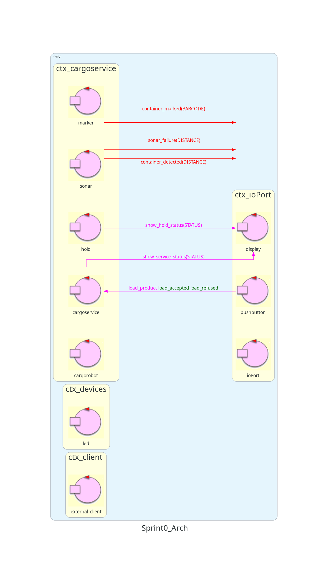
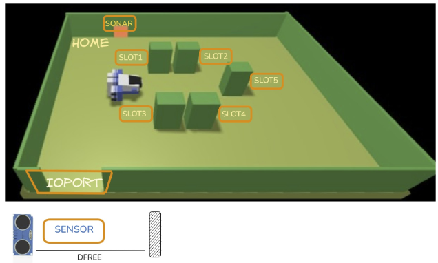
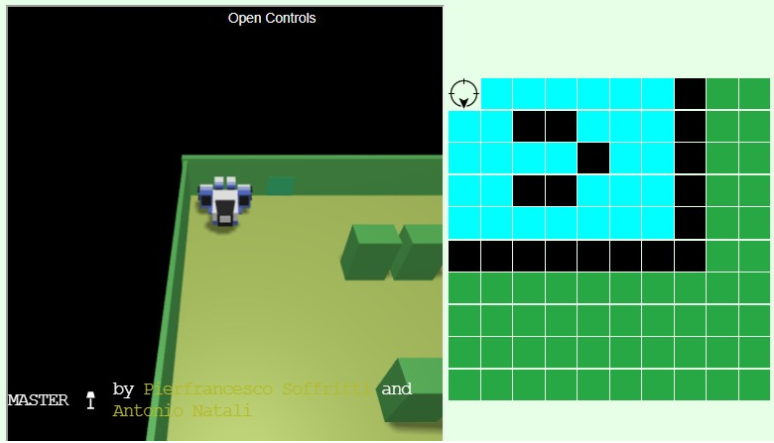

# Sprint1

## Indice

- [Sprint1](#sprint1)
  - [Indice](#indice)
  - [Punto di Partenza](#punto-di-partenza)
  - [Obiettivi](#obiettivi)
  - [Analisi del Problema](#analisi-del-problema)
    - [Componenti Software già implementate](#componenti-software-già-implementate)
    - [Componenti software](#componenti-software)
      - [Interazioni tra i quattro attori](#interazioni-tra-i-quattro-attori)
      - [cargoservice_handler](#cargoservice_handler)
      - [cargoservice_worker](#cargoservice_worker)
      - [cargorobot](#cargorobot)
      - [marker](#marker)
    - [Messaggi](#messaggi)
      - [Prelievo del container dall'IOPort](#prelievo-del-container-dallioport)
      - [Prenotazione dello slot nell'hold](#prenotazione-dello-slot-nellhold)
      - [Marcatura del container](#marcatura-del-container)
      - [Navigazione del robot](#Navigazione-del-robot)
    - [Diagramma dell'architettura](#diagramma-dellarchitettura)
  - [Piano di test](#piano-di-test)
  - [Piano di lavoro](#piano-di-lavoro)
  - [Ripartizione del lavoro](#ripartizione-del-lavoro)


<!--devo fare analisi del problema, piano di test e diag architettura -->

## Punto di Partenza

Il committente (una compagnia di trasporto marittimo) vuole automatizzare il carico di container nella stiva di una nave (_hold_) impiegando un robot a trazione differenziale (_cargorobot_). L'hold è un'area rettangolare piana con una porta di ingresso/uscita (**IOPort**), quattro **slot** (`slot1`…`slot4`) in cui depositare un container ciascuno e un'area temporanea, **slot5**, in cui il cargorobot deposita il container per la marcatura: un dispositivo **marker** applica un codice a barre identificativo e segnala il termine dell'operazione.

L'IOPort è composto da un **pushbutton**, premuto dal cliente per richiedere il carico, e da un **display**, che mostra la risposta alla richiesta e lo stato corrente dell'hold. Il **sonar** associato all'IOPort rileva la presenza di un container quando misura una distanza `D < DFREE/2` per un tempo ragionevole (es. 3 s). Un **led** deve lampeggiare finché il sistema è _engaged_.

Il servizio da realizzare è il **cargoservice**, che si comporta come segue:

- risponde `retrylater` se l'IOPort è occupato da un container o se il sistema è _out of service_;
- rifiuta la richiesta se l'hold è pieno (slot1–4 tutti occupati);
- altrimenti considera il sistema _engaged_, individua uno slot libero e ne restituisce il nome come risposta; durante l'_engaged_ il led lampeggia;
- una volta accettata la richiesta, il cliente deve portare il container nell'area del sonar entro un tempo prefissato (es. 30 s), altrimenti il sistema torna _disengaged_;
- a container presente, il cargorobot lo sposta dall'IOPort allo slot5 (marcatura) e poi allo slot riservato;
- il display mostra lo stato dell'hold, il messaggio "Service working" nel funzionamento normale e "Out of service" se il sonar misura `D > DFREE` per almeno 3 s (possibile guasto del sonar).

Lo Sprint0 ha analizzato questi requisiti e definito l'architettura iniziale, con quattro contesti (`ctx_cargoservice`, `ctx_ioport`, `ctx_devices`, `ctx_client`), i messaggi di base (ad esempio `system_failure` e `container_marked`) e il modello `Arch_sprint0` con gli attori principali, per lo più come _stub_ privi di comportamento.



## Obiettivi

Lo Sprint1 ha lo scopo di realizzare il **core business** del sistema: il ciclo di carico di un container, dalla richiesta accettata al deposito nello slot riservato e al ritorno del robot in `home`. Gli attori coinvolti sono **cargoservice**, **cargorobot** e **marker**; sonar, hold, IOPort, led e display sono presenti come supporto o stub e vengono completati negli sprint successivi.

| Componente   | Funzionalità da realizzare                                                                                                                                                                                                                                                                                                                                                 |
| ------------ | -------------------------------------------------------------------------------------------------------------------------------------------------------------------------------------------------------------------------------------------------------------------------------------------------------------------------------------------------------------------------- |
| Cargoservice | gestire le richieste di carico (`retrylater` per IOPort occupato o sistema _out of service_, rifiuto per hold pieno, altrimenti risposta con lo slot riservato); informare il cliente sulla disponibilità del sistema; guidare il cargorobot lungo il ciclo di carico; mantenere una rappresentazione dell'hold; gestire il ritorno a _disengaged_ dopo 30 s senza container; gestire l'_out of service_ per `D > DFREE` misurata dal sonar |
| Cargorobot   | muoversi tra le posizioni note (`home`, `io_port`, `marker`/slot5, `slot1`…`slot4`) distinguendo il movimento con e senza container; gestire carico e scarico del container; comunicare l'esito dei movimenti al cargoservice                                                                                                                                              |
| Marker       | ricevere la richiesta di marcatura dal cargoservice e notificarne il completamento                                                                                                                                                                                                                                                                                        |

Lo stato di realizzazione di ciascuna funzionalità è discusso nelle sezioni di analisi, dove sono indicati anche i punti ancora aperti (marcati come _TODO_ nel modello `sprint1.qak`).

### Modifiche introdotte rispetto allo Sprint0

- **Scomposizione del cargoservice** in due attori: `cargoservice_handler` (interazione con il cliente e stato globale del servizio) e `cargoservice_worker` (esecuzione del ciclo di carico).
- **Nuovo attore `marker`**, che simula la marcatura assegnando al container un codice progressivo al posto del codice a barre.
- **`cargorobot` come astrazione dello SmartRobot**: il resto del sistema usa nomi di posizione (`io_port`, `slot1`, …) invece di coordinate.
- **Nuovi messaggi** per prenotazione dello slot, prelievo dall'IOPort, marcatura e Navigazione (descritti nella sezione _Messaggi_).

## Analisi del Problema

L'analisi traduce i requisiti del committente in responsabilità per i singoli attori. Il sistema deve:

1. accettare una richiesta di carico solo se il servizio è operativo, l'IOPort è libero e nell'hold c'è almeno uno slot libero, rispondendo altrimenti con `retrylater` (IOPort occupato o servizio _out of service_) o con un rifiuto (hold pieno);
2. prenotare uno slot, prelevare il container dall'IOPort, portarlo allo slot5 per la marcatura e infine nello slot prenotato, riportando poi il robot in `home`;
3. portarsi in _out of service_ in caso di guasto, e tornare _disengaged_ se il container non arriva entro il tempo prefissato.

Per soddisfarli, la responsabilità è stata divisa tra due attori del cargoservice. `cargoservice_handler` gestisce l'interazione con il cliente e l'I/O (pushbutton, display); `cargoservice_worker` gestisce il funzionamento del cargorobot e monitora lo stato dell'hold.

Le attività di `cargoservice_handler` sono:

- gestire le richieste di carico del cliente;
- mostrare sul display le informazioni relative allo stato del servizio.

Le attività di `cargoservice_worker` sono:

- monitorare lo stato dell'hold e comunicarlo al `cargoservice_handler` quando richiesto;
- gestire il funzionamento del cargorobot;
- gestire i moduli interni all'hold (sonar e marker) e assicurarne il corretto funzionamento.

**Scostamenti noti tra modello e requisiti.** Nel modello attuale `cargoservice_handler` risponde `engage_refused(ioport_occupied)` quando l'IOPort è occupato, mentre il committente richiede `retrylater`; la risposta all'hold pieno è invece prodotta dal worker. Inoltre il led, il timeout di 30 s e il controllo `D > DFREE` non sono ancora modellati. Sono punti da allineare nel corso dello sprint o degli sprint successivi.

### Componenti Software già implementate



Analizziamo più in dettaglio il VirtualRobot26 fornito dal committente:

Utilizzeremo il servizio WEnv come un virtual environment per simulare un Differential Drive Robot composto da 3 ruote di cui due sono ruote motrici, che si muove all'interno di un rettangolo contenente vari elementi descritti dal committente (slot, marker, sonar,...).

La comunicazione con il virtual environment viene effettuata in due modi:

- HTTP POST sulla porta 8090 — sincrono, request/response il servizio WEnv accetta una sola connessione.
- WebSocket sulla porta 8091 — asincrono, fire-and-forget; WEnv accetta più connessionie e il servizio invia un messaggio a tutti i client connessi.

Sintassi per i messaggi al robot sono definiti tramite
cril (concrete-robot interaction language), la sintassi del comando è la seguente:

```
{"robotmove":"CMDMOVE", "time":T}
CMDMOVE ::= turnLeft | turnRight | moveForward | moveBackward | alarm
```

Un comando in esecuzione può essere interrotto solo tramite un'allarme, un qualsiasi altro comando asincrono ricevuto durante l'esecuzione è rifiutato mentre l'originale continua la sua esecuzione fino alla sua terminazione. In caso di una collisione, il movimento dura comunque un tempo T, ma i WS clients ottengono {"collision":"MOVEID","target":"OBSTACLEID"}.

Per quanto riguarda la semantica dei messaggi asincroni, invece di utilizzare il linguaggio cril, viene introdotto il linguaggio aril (Abstract Robot Interaction Lanaguage). Aril è definito come segue:
```
MOVE = w | s | l | a | r | d | h
```
dove ww : muove avanti per 2500 msec; s: muove indietro per 2500 msec; l, a: gira a sinistra di 90 per 300msec; r, d: gira a destra di 90 per 300 msec; h: indica al robot di fermarsi

Il WEnv è deployable attraverso una docker image, anch'essa fornita dal committente. Insieme al WEnv viene fornita una NaiveGui, ovvero un'interfaccia gfrafica con cui comandare direttamente il robot nell ambiente virtuale da tastiera (i tasti w/a/s/d vengono utilizzati per muovere il robot). La NaiveGui permette anche di modificare l'ambiente virtuale: aggiungere oggetti o spostare quelli già presenti, e modificare la velocità del robot.

Il committente ha presentato varie versioni del VirtualRobot26, e abbiamo scelto di implementare cargorobot utilizzando lo SmartRobot26 invece del semplice BasicRobot26 per sfruttare le capacità dello SmartRobot26 di navigare il VirtualEnvironment utilizzando un sistema di coordinate invece di richiedere multipli comandi aril. In aggiunta a queste funzionalità, SmartRobot26 dispone di un'ulteriore Gui oltre a NaiveGui, accedibile appa porta 9085 dopo aver lanciato il container usando il file `vrWithGui26.yaml`. Questa Gui contiene anche una rappresentazione a griglia del Virtual Environment, che viene aggiornata utilizzando la memoria interna del robot, non utilizzando la conologia dei comandi ricevuti dal server. Questa rappresentazione poi verrà usata per individuare le coordinate dove muovere il robot.



SmartRobot inoltre è capace di creare una Context map: una matrice di interi così strutturata: "0" indica una cella libera, "1" indica una presenza di un'ostacolo, "r" indca la posizione del robot all'iinterno dell'Ambiente Virtuale. Notiamo che ogni cella della matrice (e quindi utilizzabile dalla navigazione dell'Ambiente Virtuale) corrisponde ad uno spazio con la stessa area che il VirtualRobot occupa sull'Ambiente Virtuale. Un esempio di una stringa che descrive l'Ambiente Virtuale è: r000001@0011001@0000101@0011001@0000001@1111111

L'algoritmo usato dal robot per navigare l'Ambiente Virtuale è A\*.

### Componenti software

Per quanto riguarda, i macrocomponenti da sviluppare riportiamo:

- **cargoservice_handler**
- **cargoservice_worker**
- **cargorobot**
- **marker**

- **hold** <!-- cosa si intende per stato corrente dell'hold -->
- **led** <!-- chiedere se va tenuto come componente separato o inserirlo dentro IOPort -->

In questo sprint vengono modellati, nel file `sprint1.qak`, i QActors che realizzano il core business: **cargoservice_handler**, **cargoservice_worker**, **cargorobot** e **marker**. Tutti e quattro appartengono al contesto `ctx_cargoservice` (porta 8000). Gli altri attori del modello (`hold`, `io_port`, `display`, `sonar`, `led`, `pushbutton`, `external_client`) sono presenti come supporto o come _stub_ e verranno raffinati negli sprint successivi.

Ogni attore è una macchina a stati finiti: gli stati sono introdotti da `State`, lo stato iniziale è marcato con `initial`, e l'evoluzione è guidata dalle `Transition` (`whenRequest`, `whenMsg`, `whenReply`, `whenEvent`) oppure dalle `Goto` incondizionate.

#### Interazioni tra i quattro attori

| Mittente             | Messaggio                                                              | Tipo     | Destinatario                                                   |
| -------------------- | ---------------------------------------------------------------------- | -------- | -------------------------------------------------------------- |
| cliente              | `start_engage(ARG)`                                                    | Request  | cargoservice_handler                                           |
| cargoservice_handler | `engage_successful(ARG)` / `engage_refused(ARG)` / `retrylater(CAUSE)` | Reply    | cliente                                                        |
| cargoservice_handler | `startWorking(ARG)`                                                    | Dispatch | cargoservice_worker                                            |
| cargoservice_worker  | `taskCompleted(ARG)`                                                   | Dispatch | cargoservice_handler                                           |
| cargoservice_worker  | `system_failure(ARG)`                                                  | Event    | (chiunque sia in ascolto, in particolare cargoservice_handler) |
| cargoservice_worker  | `moverobot(SLOT)`                                                      | Request  | cargorobot                                                     |
| cargorobot           | `moverobotdone(ARG)` / `moverobotfailed(PLANDONE, PLANTODO)`           | Reply    | cargoservice_worker                                            |
| cargorobot           | `setrobotstate: setpos(X,Y,D)`                                         | Dispatch | robotsmart                                                     |
| cargorobot           | `moverobot(TARGETX, TARGETY, STEPTIME)`                                | Request  | robotsmart                                                     |
| cargoservice_worker  | `start_marking(ARG)`                                                   | Request  | marker                                                         |
| marker               | `container_marked(BARCODE)`                                            | Event    | cargoservice_worker                                            |

#### cargoservice_handler

**Ruolo:** È il punto di ingresso del servizio: riceve le richieste di carico del cliente, decide se accettarle e, quando una richiesta viene accettata, delega l'esecuzione del lavoro a `cargoservice_worker`. Mantiene lo stato globale del servizio (se è operativo, se è già impegnato in un carico) e lo pubblica come risorsa osservabile.

**Stato interno** (blocco `[# ... #]`):

| Variabile        | Valore iniziale | Significato                                                                                                |
| ---------------- | --------------- | ---------------------------------------------------------------------------------------------------------- |
| `ServiceWorking` | `true`          | `false` quando il sistema è `out_of_service`                                                               |
| `IOPortOccupied` | `false`         | l'IOPort contiene già un container (verrà aggiornato dall'evento `robot_detected` negli sprint successivi) |
| `Engaged`        | `false`         | una richiesta è stata accettata e il carico non è ancora terminato                                         |

**Messaggi gestiti:**

- riceve la Request `start_engage` e risponde con una delle tre Reply `engage_successful`, `engage_refused`, `retrylater`;
- riceve il Dispatch `taskCompleted` da `cargoservice_worker`;
- è in ascolto dell'Event `system_failure`;
- invia a `cargoservice_worker` il Dispatch `startWorking`;
- invia a `display` il Dispatch `show_service_status`.

**Stati:**

| Stato                   | Comportamento                                                                                                                                                                                                                                                                                                                                                        |
| ----------------------- | -------------------------------------------------------------------------------------------------------------------------------------------------------------------------------------------------------------------------------------------------------------------------------------------------------------------------------------------------------------------- |
| `idle` (initial)        | Stampa `Ready`, attende 2 secondi e pubblica con `updateResource` lo stato del servizio (`cargoservice(idle, serviceWorking=…, ioportOccupied=…)`); invia a `display` `show_service_status(service_working)`. Da qui attende la prossima interazione.                                                                                                                |
| `handleLoadRequest`     | Valuta la richiesta secondo l'ordine: (1) se `!ServiceWorking` risponde `retrylater(out_of_service)`; (2) altrimenti, se `IOPortOccupied \|\| Engaged`, risponde `engage_refused(ioport_occupied)`; (3) altrimenti pone `Engaged = true`, risponde `engage_successful(0)` e inoltra `startWorking(0)` a `cargoservice_worker`. In ogni caso termina con `Goto idle`. |
| `resetEngaged`          | Raggiunto alla ricezione di `taskCompleted`: riporta `Engaged = false` e torna in `idle`.                                                                                                                                                                                                                                                                            |
| `system_out_of_service` | Raggiunto alla ricezione di `system_failure`: pone `ServiceWorking = false` e torna in `idle`; da quel momento ogni nuova richiesta riceve `retrylater`.                                                                                                                                                                                                             |

**Transizioni dello stato `idle`.**

```
Transition t0
    whenRequest start_engage  -> handleLoadRequest
    whenMsg     taskCompleted -> resetEngaged
    whenEvent   system_failure -> system_out_of_service
```

**Note di modellazione:**

- La mutua esclusione tra richieste concorrenti è garantita dal flag `Engaged`: finché `cargoservice_worker` non invia `taskCompleted`, ogni ulteriore `start_engage` viene rifiutata. Poiché un attore elabora un messaggio alla volta, il controllo e l'impostazione di `Engaged` in `handleLoadRequest` sono atomici.
- La verifica di hold piena non è effettuata qui ma nel worker, tramite la risposta `slots_unavailable` dell'`hold`.
- Restano come punti aperti (commenti `TODO` nel modello): l'aggiornamento di `IOPortOccupied` a partire da `robot_detected`, il passaggio a `out_of_service` per `sonar_failure` e la pubblicazione dello stato `engaged` al momento giusto.

#### cargoservice_worker

**Ruolo:** Esegue l'intero ciclo di carico di un container, una volta che il handler ha accettato la richiesta. Coordina `hold` (prenotazione dello slot), `cargorobot` (movimenti), `io_port` (prelievo del container) e `marker` (marcatura), ed è l'unico attore che conosce la sequenza completa dell'attività. Al termine segnala al handler la fine del lavoro.

**Stato interno.**

| Variabile | Valore iniziale | Significato                                          |
| --------- | --------------- | ---------------------------------------------------- |
| `Slot`    | `""`            | slot riservato dall'`hold` per il container corrente |
| `Code`    | `""`            | codice assegnato al container dal `marker`           |

**Messaggi gestiti:**

- riceve il Dispatch `startWorking` dal handler;
- invia a `hold` la Request `ask_for_slot` e attende `slot_obtained(SLOT)` o `slots_unavailable(ARG)`;
- invia a `cargorobot` la Request `moverobot` con destinazione `io_port`, `marker` o lo slot riservato, e attende `moverobotdone` o `moverobotfailed`;
- invia a `io_port` la Request `load_container` e attende `load_done`;
- invia a `marker` la Request `start_marking` e attende l'Event `container_marked(BARCODE)`;
- invia a `hold` il Dispatch `container_deployed(Slot, Code)`;
- invia al handler il Dispatch `taskCompleted`;
- emette l'Event `system_failure` in caso di errore.

**Stati e transizioni.**

| Stato                    | Comportamento                                                                                                                                       | Transizione in uscita                                                                      |
| ------------------------ | --------------------------------------------------------------------------------------------------------------------------------------------------- | ------------------------------------------------------------------------------------------ |
| `idle` (initial)         | Attende l'avvio del lavoro.                                                                                                                         | `whenMsg startWorking -> ask_holding`                                                      |
| `ask_holding`            | Richiede all'`hold` uno slot libero.                                                                                                                | `whenReply slot_obtained -> acceptRequest`; `whenReply slots_unavailable -> refuseRequest` |
| `refuseRequest`          | Hold piena: azzera `Slot`, stampa il rifiuto e invia `taskCompleted` al handler (che così rimuove lo stato `Engaged`).                              | —                                                                                          |
| `acceptRequest`          | Memorizza in `Slot` il nome dello slot ricevuto (`payloadArg(0)`) e chiede a `cargorobot` di raggiungere `io_port`.                                 | `whenReply moverobotdone -> at_io_port`; `whenReply moverobotfailed -> out_of_service`     |
| `at_io_port`             | Il robot è all'IOPort: richiede a `io_port` il caricamento del container.                                                                           | `whenReply load_done -> move_to_marker`                                                    |
| `move_to_marker`         | Chiede a `cargorobot` di raggiungere `marker` (slot5).                                                                                              | `whenReply moverobotdone -> at_marker`; `whenReply moverobotfailed -> out_of_service`      |
| `at_marker`              | Il robot è al marker: richiede la marcatura con `start_marking`.                                                                                    | `whenEvent container_marked -> move_container_to_slot`                                     |
| `move_container_to_slot` | Con `onMsg(container_marked)` memorizza in `Code` il codice ricevuto e chiede a `cargorobot` di raggiungere lo slot riservato (`moverobot($Slot)`). | `whenReply moverobotdone -> move_to_home`; `whenReply moverobotfailed -> out_of_service`   |
| `move_to_home`           | Il container è nello slot: invia a `hold` `container_deployed($Slot, $Code)` e chiede a `cargorobot` di tornare in `home`.                          | `whenReply moverobotdone -> task_finished`; `whenReply moverobotfailed -> out_of_service`  |
| `task_finished`          | Azzera `Slot` e `Code`, invia `taskCompleted` al handler e torna in `idle` (`Goto idle`).                                                           | —                                                                                          |
| `out_of_service`         | Un movimento è fallito: azzera `Slot`, emette `system_failure` e torna in `idle`. Il handler reagirà ponendo `ServiceWorking = false`.              | `Goto idle`                                                                                |

Il flusso principale è dunque:

```
idle → ask_holding → acceptRequest → at_io_port → move_to_marker
     → at_marker → move_container_to_slot → move_to_home → task_finished → idle
```

**Note di modellazione:**

- Il worker è _event-aware_ solo nello stato `at_marker`, dove l'Event `container_marked` è atteso con `whenEvent`. Il payload viene poi letto in `move_container_to_slot` tramite `onMsg`.
- La prenotazione dello slot avviene prima di qualsiasi movimento, in modo che l'`hold` possa rifiutare subito una richiesta quando tutti gli slot sono occupati; la scrittura nello slot (`container_deployed`) avviene solo a container depositato.
- Lo stato `setIOPortOccupied` è predisposto ma ancora vuoto: verrà completato negli sprint che introducono sonar e IOPort.
- Dopo `refuseRequest` il modello attuale non dichiara una transizione di ritorno a `idle`; è un'inesattezza da correggere (aggiungendo `Goto idle`), poiché altrimenti il worker non sarebbe in grado di servire una seconda richiesta dopo un rifiuto.

#### cargorobot

**Ruolo:** Astrae lo SmartRobot fornito dal committente (attore esterno `robotsmart`, contesto `ctx_smartrobot`, porta 8020) esponendo al resto del sistema un'interfaccia basata sui _nomi_ delle posizioni (`home`, `io_port`, `slot1`…`slot4`, `marker`) anziché sulle coordinate. Traduce la richiesta ad alto livello `moverobot(SLOT)` nella richiesta `moverobot(X, Y, STEPTIME)` verso `robotsmart`, che pianifica il percorso con l'algoritmo A\* sulla mappa della hold, e ritorna al chiamante l'esito del movimento.

**Stato interno.**

| Variabile        | Significato                                                                                                                                           |
| ---------------- | ----------------------------------------------------------------------------------------------------------------------------------------------------- |
| `slots`          | mappa `nome → [X, Y]` delle posizioni note: `home` (0,0), `io_port` (4,0), `slot1` (1,1), `slot2` (3,1), `slot3` (1,4), `slot4` (3,4), `marker` (2,5) |
| `currentPos`     | posizione corrente del robot (inizialmente `home`)                                                                                                    |
| `Xtemp`, `Ytemp` | coordinate della destinazione in corso, confermate in `currentPos` solo a movimento riuscito                                                          |

**Messaggi gestiti:**

- riceve da `cargoservice_worker` la Request `moverobot(SLOT)`;
- invia a `robotsmart` il Dispatch `setrobotstate: setpos(0,0,down)` all'avvio e la Request `moverobot(TARGETX, TARGETY, STEPTIME)` per ogni spostamento (lo `STEPTIME` utilizzato è 345 ms);
- riceve da `robotsmart` le Reply `moverobotdone` o `moverobotfailed` e le inoltra al worker con `replyTo`.

**Stati e transizioni.**

| Stato               | Comportamento                                                                                                                                                                                                | Transizione in uscita                                                                                                           |
| ------------------- | ------------------------------------------------------------------------------------------------------------------------------------------------------------------------------------------------------------ | ------------------------------------------------------------------------------------------------------------------------------- |
| `setup` (initial)   | Imposta `currentPos` a `home` e allinea lo SmartRobot con `setpos(0,0,down)`.                                                                                                                                | `Goto wait`                                                                                                                     |
| `wait`              | Pubblica con `updateResource` `cargorobot(idle)`.                                                                                                                                                            | `whenRequest moverobot -> move`; `whenReply moverobotdone -> move_robot_done`; `whenReply moverobotfailed -> move_robot_failed` |
| `move`              | Con `onMsg(moverobot)` risolve il nome ricevuto in coordinate tramite `slots`. Se la destinazione è valida salva `Xtemp`, `Ytemp` e invia la richiesta a `robotsmart`; altrimenti stampa `Target not valid`. | `Goto wait`                                                                                                                     |
| `move_robot_done`   | Aggiorna `currentPos` con `(Xtemp, Ytemp)` e risponde `moverobotdone` al richiedente originale.                                                                                                              | `Goto wait`                                                                                                                     |
| `move_robot_failed` | Risponde `moverobotfailed` al richiedente originale.                                                                                                                                                         | `Goto wait`                                                                                                                     |

**Note di modellazione:**

- Il nome `moverobot` è usato per due Request distinte (`moverobot(SLOT)` verso `cargorobot`, `moverobot(TARGETX, TARGETY, STEPTIME)` verso `robotsmart`): la distinzione è determinata dal destinatario.
- Il cargorobot gestisce un movimento alla volta: finché la risposta di `robotsmart` non arriva, la nuova richiesta resta in coda nella mailbox dell'attore. Questo è coerente con il fatto che il worker invia una sola `moverobot` per volta e attende sempre la Reply.
- Non è ancora modellata la distinzione tra movimento _con_ e _senza_ container (obiettivo dello Sprint1 per il cargorobot): la differenza per ora è solo di significato, non di comportamento.
- Se la destinazione non è nella mappa `slots`, il modello attuale non invia alcuna Reply: in questo caso il worker resterebbe in attesa. Va quindi aggiunta una `replyTo moverobotfailed`.

#### marker

**Ruolo:** Simula il servizio di marcatura dello slot5: ricevuta la richiesta, assegna al container un codice identificativo univoco (in sostituzione del codice a barre reale) e ne notifica il completamento a chi è in ascolto.

**Stato interno.**

| Variabile    | Valore iniziale | Significato                                                           |
| ------------ | --------------- | --------------------------------------------------------------------- |
| `CodeNumber` | `1`             | contatore progressivo usato per generare i codici `code1`, `code2`, … |

**Messaggi gestiti:**

- riceve la Request `start_marking(ARG)` da `cargoservice_worker`;
- emette l'Event `container_marked(BARCODE)` con il codice generato.

**Stati e transizioni.**

| Stato            | Comportamento                                                                                                                                                                                        | Transizione in uscita                  |
| ---------------- | ---------------------------------------------------------------------------------------------------------------------------------------------------------------------------------------------------- | -------------------------------------- |
| `wait` (initial) | Pubblica con `updateResource` `marker(idle)`.                                                                                                                                                        | `whenRequest start_marking -> marking` |
| `marking`        | Pubblica `marker(marking)`, simula la durata della marcatura con `delay 2000`, genera `code<N>` incrementando `CodeNumber`, emette `container_marked(code<N>)` e pubblica lo stato di completamento. | `Goto wait`                            |

**Note di modellazione:**

- Il risultato è comunicato con un **Event** e non con una Reply: in questo modo il completamento della marcatura è osservabile da qualunque componente interessato (ad esempio un futuro monitor o il display), non solo dal richiedente. Il worker lo cattura con `whenEvent container_marked` nello stato `at_marker`, dove si trova già in attesa; l'ordine di emissione è quindi sicuro perché il worker entra in `at_marker` prima che il marker abbia concluso i suoi 2 secondi di marcatura.
- Il marker non conosce il robot né l'hold: l'unico accoppiamento con il resto del sistema è la coppia `start_marking` / `container_marked`.
- La risorsa osservabile pubblicata a fine marcatura contiene il valore fisso `marker(completed,code001)` anziché il codice effettivamente generato: è un'imprecisione da allineare al codice emesso.

### Messaggi

Lo Sprint1 mantiene i messaggi definiti nello Sprint0 e introduce i contratti di interazione necessari a realizzare il ciclo di carico: prenotazione dello slot nell'`hold`, prelievo del container dall'`io_port`, marcatura e Navigazione del robot. Di seguito sono descritti solo i **nuovi messaggi**, così come dichiarati in `sprint1.qak`.

```
Request load_container : load_container(ARG)
Reply load_done : load_done(SLOT) for load_container

Request ask_for_slot : ask_for_slot(ARG)
Reply slot_obtained : slot_obtained(SLOT) for ask_for_slot
Reply slots_unavailable : slots_unavailable(ARG) for ask_for_slot

Dispatch container_deployed : container_deployed(Slot, Code)

Request start_marking : start_marking(ARG)

Request moverobot : moverobot(SLOT)
Request moverobot : moverobot(TARGETX, TARGETY, STEPTIME)
Reply moverobotdone : moverobotdone(ARG) for moverobot
Reply moverobotfailed : moverobotfailed(PLANDONE, PLANTODO) for moverobot

Dispatch setrobotstate : setpos(X,Y,D)
Dispatch setplanbuildelay : value(V)
Request tuneAtHome : tuneAtHome(X)
Reply tuneDone : tuneDone(X) for tuneAtHome
```

#### Prelievo del container dall'IOPort

**`load_container(ARG)`** — _Request_, da `cargoservice_worker` a `io_port`.

- **Scopo**: chiedere all'IOPort di consegnare al robot il container in attesa. Viene inviata quando il `cargorobot` ha raggiunto l'`io_port` (stato `at_io_port` del worker).
- **Payload**: `ARG` è un argomento segnaposto, nel modello è inviato come `ARG`; non porta informazioni.
- **Elaborazione**: `io_port` simula il caricamento con `delay 2000` e poi risponde.

**`load_done(SLOT)`** — _Reply_ a `load_container`, da `io_port` a `cargoservice_worker`.

- **Scopo**: segnalare che il container è stato caricato e che il robot può ripartire verso il marker.
- **Payload**: `SLOT` è dichiarato nel contratto, ma `io_port` risponde con un argomento segnaposto (`load_done(ARG)`); il worker non lo utilizza. Alla ricezione il worker passa a `move_to_marker`.

#### Prenotazione dello slot nell'hold

**`ask_for_slot(ARG)`** — _Request_, da `cargoservice_worker` a `hold`.

- **Scopo**: chiedere all'`hold` di riservare uno slot libero per il container da caricare. È la prima azione del worker dopo `startWorking`, cioè prima di qualunque movimento del robot.
- **Payload**: `ARG` è un argomento segnaposto.
- **Elaborazione**: l'`hold` sceglie il primo slot libero tra `slot1`…`slot4` (stato `choose_slot`) e risponde con una delle due Reply seguenti.

**`slot_obtained(SLOT)`** — _Reply_ a `ask_for_slot`, da `hold` a `cargoservice_worker`.

- **Scopo**: comunicare che la richiesta è accettata e quale slot è riservato.
- **Payload**: `SLOT` è il nome dello slot (`slot1`, `slot2`, `slot3` o `slot4`). Il worker lo memorizza nella variabile `Slot` e lo utilizza come destinazione per il trasporto finale del container.
- **Effetto**: il worker procede con `acceptRequest` e muove il robot verso l'`io_port`.

**`slots_unavailable(ARG)`** — _Reply_ a `ask_for_slot`, da `hold` a `cargoservice_worker`.

- **Scopo**: comunicare che la hold è piena (tutti gli slot sono occupati) e che il carico non può essere eseguito.
- **Payload**: `ARG` vale `0` ed è un segnaposto.
- **Effetto**: il worker passa a `refuseRequest`, azzera `Slot` e invia `taskCompleted` al handler per liberare lo stato `Engaged`.

**`container_deployed(Slot, Code)`** — _Dispatch_, da `cargoservice_worker` a `hold`.

- **Scopo**: notificare all'`hold` che il container è stato collocato nello slot riservato, in modo che quello slot risulti occupato nelle richieste successive.
- **Payload**: `Slot` è il nome dello slot riservato (lo stesso ottenuto con `slot_obtained`); `Code` è il codice assegnato dal `marker` al container (quello ricevuto con `container_marked`).
- **Elaborazione**: l'`hold` aggiorna la propria mappa `slot → codice` (stato `update_map`). Se `Slot` non è una chiave nota emette l'Event `system_failure` (già definito nello Sprint0), che porta il sistema in `out_of_service`.
- **Scelta di modellazione**: è un Dispatch e non una Request perché il worker non deve attendere alcun esito: l'inconsistenza dell'`hold`, se presente, è gestita come guasto di sistema.

#### Marcatura del container

**`start_marking(ARG)`** — _Request_, da `cargoservice_worker` a `marker`.

- **Scopo**: avviare la marcatura del container che il robot ha depositato nello slot5 (`marker`). Viene inviata nello stato `at_marker` del worker.
- **Payload**: `ARG` è un argomento segnaposto.
- **Risposta**: il `marker` non risponde con una Reply, ma emette l'Event `container_marked(BARCODE)` (definito nello Sprint0) al termine della marcatura; il worker lo attende con `whenEvent`. La Request serve quindi ad avviare l'attività, mentre l'esito è reso osservabile a tutti gli attori interessati.

#### Navigazione del robot

Il nome `moverobot` identifica due Request distinte, corrispondenti a due livelli di astrazione. Esse sono distinte dal destinatario e dal numero di argomenti del payload.

**`moverobot(SLOT)`** — _Request_ ad alto livello, da `cargoservice_worker` a `cargorobot`.

- **Scopo**: chiedere al `cargorobot` di portarsi in una posizione identificata dal nome.
- **Payload**: `SLOT` assume uno dei valori noti al `cargorobot`: `home`, `io_port`, `slot1`, `slot2`, `slot3`, `slot4`, `marker`. Il worker non conosce le coordinate: il nome viene tradotto in `(X, Y)` dal `cargorobot`.
- **Risposta**: `moverobotdone` o `moverobotfailed`.
- **Utilizzo nel ciclo di carico**: `io_port` → `marker` → `<slot riservato>` → `home`.

**`moverobot(TARGETX, TARGETY, STEPTIME)`** — _Request_ di basso livello, da `cargorobot` a `robotsmart` (attore esterno nel contesto `ctx_smartrobot`).

- **Scopo**: ordinare allo SmartRobot di raggiungere una cella della mappa; il percorso è pianificato dallo SmartRobot con l'algoritmo A\*.
- **Payload**: `TARGETX` e `TARGETY` sono le coordinate di destinazione (colonna e riga della cella); `STEPTIME` è il tempo, in millisecondi, di ogni passo del robot. Il `cargorobot` lo imposta a `345`.
- **Risposta**: `moverobotdone` o `moverobotfailed`.

**`moverobotdone(ARG)`** — _Reply_ a `moverobot`, da `robotsmart` a `cargorobot` e da `cargorobot` a `cargoservice_worker`.

- **Scopo**: indicare che la destinazione è stata raggiunta.
- **Payload**: `ARG` è un segnaposto.
- **Effetto**: il `cargorobot` aggiorna `currentPos` con la posizione richiesta e inoltra la Reply al worker, che passa allo stato successivo del ciclo di carico.

**`moverobotfailed(PLANDONE, PLANTODO)`** — _Reply_ a `moverobot`, da `robotsmart` a `cargorobot` e da `cargorobot` a `cargoservice_worker`.

- **Scopo**: indicare che il robot non ha completato il movimento (ad esempio per un ostacolo sul percorso).
- **Payload**: `PLANDONE` è la parte di piano già eseguita e `PLANTODO` la parte ancora da eseguire. Il `cargorobot` inoltra al worker la Reply con un unico argomento segnaposto; il dettaglio del piano non viene propagato.
- **Effetto**: il worker passa allo stato `out_of_service`, emette `system_failure` e il handler pone `ServiceWorking = false`.

**`setrobotstate: setpos(X,Y,D)`** — _Dispatch_, da `cargorobot` a `robotsmart`.

- **Scopo**: allineare lo stato interno dello SmartRobot con la posizione assunta dal `cargorobot`.
- **Payload**: `X` e `Y` sono le coordinate della cella; `D` è la direzione, con valori `up`, `down`, `left`, `right`.
- **Utilizzo**: inviato una sola volta in fase di `setup`, con `setpos(0,0,down)` (posizione `home`).

**`setplanbuildelay: value(V)`**, **`tuneAtHome: tuneAtHome(X)`**, **`tuneDone: tuneDone(X)`** — fanno parte dell'interfaccia dello SmartRobot e sono dichiarati nel modello per completezza, ma non sono ancora utilizzati dagli attori dello Sprint1.

- `setplanbuildelay(V)` (_Dispatch_): imposta un ritardo `V ≥ 0` nella costruzione del piano di movimento.
- `tuneAtHome(X)` (_Request_) e `tuneDone(X)` (_Reply_): riallineano il robot alla posizione `home`; il valore `X` è ininfluente.

### Diagramma dell'architettura

Il seguente diagramma rappresenta l'architettura completa del sistema nello sprint 1.


## Piano di test

In questa fase di test verifichiamo il funzionamento corretto dei componenti implementati. In particolare sfruttiamo il fatto che i codici assegnati dal marker sono incrementali, quindi dopo un'iniziale esecuzione del percorso completo (home-ioPort-matrker-slot-home) chiediamo di effettuare una marcatura "a vuoto" per verificare che il codice emesso sia quello corretto. 

In questo modo possiamo verificare il corretto funzionamento di tutti i componenti in un solo test. Lo svantaggio di questo approccio sta nel fatto che complica l'individuazione della causa del fallimento (non testiamo i singolo componenti ma il sistema). Per ovviare a questo svantaggio utilizziamo la Gui per monitorare il progresso del robot e stampiamo a terminale tutti i passaggi di stato dei QActors necessari per il corretto funzionamento del sistema.

```text
	
	@Test
	public void testMoveRobot() throws Exception{
		System.out.println("TESTER | Starting...");
		IApplMessage request = CommUtils.buildDispatch("tester", "startWorking", "startWorking(ARG)", "cargoservice_worker");
		System.out.println("CARGOROBOT | Richiesta: " + request.toString());
		
		conn.forward(request);
		
		TimeUnit.SECONDS.sleep(40);
		
		request = CommUtils.buildRequest("tester", "start_marking", "start_marking(ARG)", "marker");
		System.out.println("CARGOROBOT | Richiesta: " + request.toString());
		
		String response = conn.request(request).toString();
		System.out.println("CARGOROBOT | Risposta: " + response.toString());
		
		assertTrue("TEST: Seconda richiesta rifiutata",
	    		response.contains("code2"));
		
	}
```

## Piano di lavoro

Rispetto a quanto dichiarato nello Sprint0 le tempistiche dello Sprint1 non sono state rispettate; la pianificazione è stata quindi rivista in modo da concludere il progetto entro fine ottobre 2026.

1. Sprint 1 (conclusione entro il 6/10)
   - cargoservice (core business del sistema)
   - cargorobot e marker
   - piano di test del core business
1. Sprint 2 (7/10 – 15/10)
   - sonar
   - hold
   - IO port e pushbutton
1. Sprint 3 (16/10 – 22/10)
   - led
   - web-gui
   - display

La pianificazione temporale costituisce un riferimento per il team: sono contemplate variazioni nel limite del ragionevole, purché non compromettano la consegna entro fine ottobre.

## Ripartizione del lavoro

Tutti i membri del gruppo hanno partecipato attivamente a tutte le fasi dello sviluppo. Le difficoltà principali hanno riguardato l'analisi e la progettazione più che l'implementazione, e sono state affrontate con sessioni di brainstorming collettivo: il confronto tra punti di vista diversi porta a soluzioni condivise e permette di individuare presto errori e fraintendimenti.
